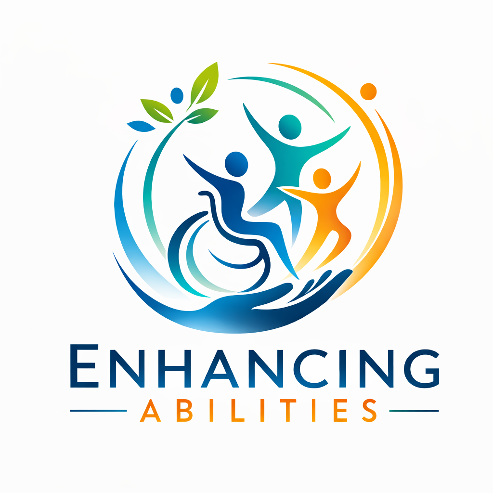
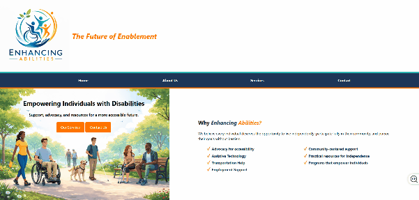
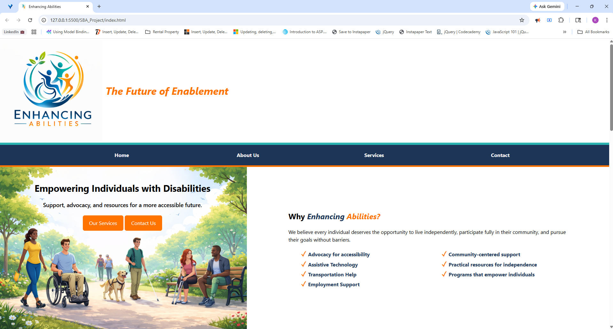

<h1 align="center">Enhancing Abilities</h1>

  

   &nbsp;&nbsp;
  

   &nbsp;&nbsp;
  &nbsp;&nbsp;
  &nbsp;&nbsp;
  

A responsive accessibility-focused website demonstrating modern HTML and CSS layout techniques while highlighting the importance of inclusive digital experiences.

---

## Project Preview

  <em>Click the preview to open the live site</em>

### Static Screenshot

  

---

## About the Project

**Enhancing Abilities** is a web design project focused on building an accessible and responsive layout using modern HTML and CSS techniques.

The project emphasizes:

- Clear visual hierarchy
- Accessible markup
- Responsive design
- Clean semantic structure

It demonstrates how thoughtful design can make websites easier to navigate and more usable for everyone.

---

## Features

- Responsive **hero section**
- Clean **semantic HTML5 structure**
- **Accessible markup** using ARIA where appropriate
- **Responsive images and layout**
- Custom **favicon for browser tab**
- Flexible layout using **modern CSS techniques**

---

## Technologies Used

- HTML5
- CSS3
- Flexbox
- Responsive design
- Git / GitHub

---
## What I Practiced

This project helped strengthen skills in:

- Building structured layouts with **HTML**
- Designing with **responsive CSS**
- Understanding **accessibility best practices**
- Using **Git and GitHub for version control**

---

## Live Preview

See a preview here:

https://keokistevenson.github.io/SBA2-Building-a-Responsive-and-Accessible-WebPage/

---

## Author

Built by Keoki M. Stevenson as part of ongoing web development practice and portfolio work.

---

  

